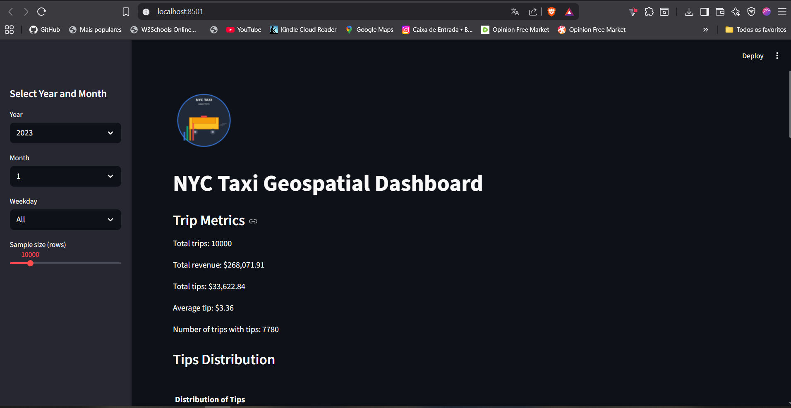
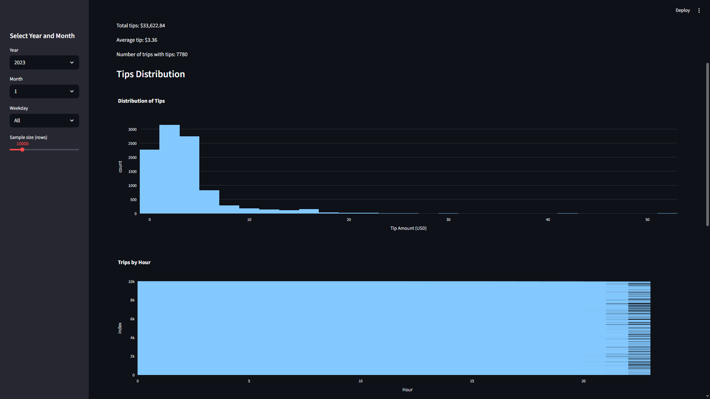
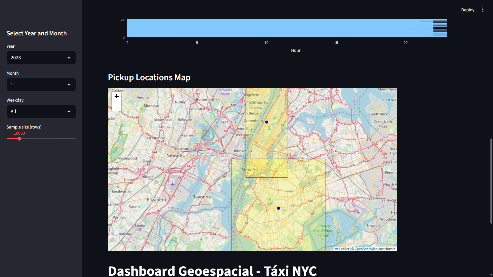
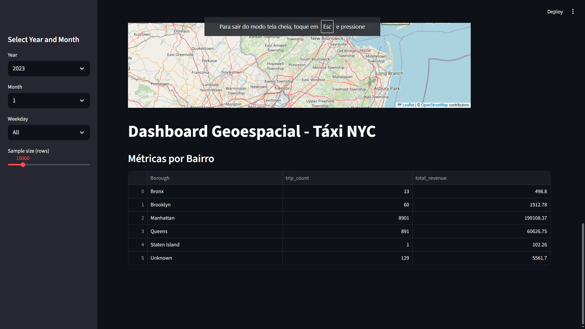

# NYC Yellow Taxi Interactive Dashboard & Geospatial Analysis

  

## Project Objective
- Provide an interactive dashboard for NYC Yellow Cab official data (Parquet format, 2023-2024), with borough-level analytics, trip metrics, and tip (gorjeta) statistics.
- Key metrics: total trips, total revenue, total and average tips, number of trips with tips, distribution of tips.
- Interactive map by borough, with filters for year, month, weekday, and sample size.
- All code and documentation in English, ready for international publication.

## Features
- Loads official NYC Yellow Taxi Parquet files (monthly, 2023-2024).
- Sidebar filters: year, month, weekday, sample size (up to 50,000 rows).
- Metrics: trip count, total revenue, total tips, average tip, trips with tips.
- Tip distribution chart (histogram).
- Interactive map by borough (using GeoJSON and LocationID lookup).
- Metrics by borough (trip count, revenue).
- Fast and memory-efficient: loads only selected sample and columns.

## Example Dashboard Output

### Main Dashboard

  

*Main dashboard view with sidebar filters and trip/tip metrics.*

### Tips Distribution

  

*Histogram showing the distribution of tip values for selected period/sample.*

### Interactive Map by Borough

  

*Interactive map of NYC boroughs with pickup locations.*

### Metrics by Borough Table

  

*Table with trip count and revenue per borough.*

## How to Run
- Run `streamlit run scripts/dashboard.py` to launch the dashboard.
- Use the sidebar to select year, month, weekday, and sample size.

## Dependencies
- Python 3.11+
- geopandas
- folium
- scikit-learn
- streamlit
- plotly
- pyarrow
- pandas

## Data
- Official NYC Yellow Taxi Parquet files: `data/yellow_tripdata_YYYY-MM.parquet`
- Taxi zone lookup: `data/taxi_zone_lookup.csv`
- NYC boroughs GeoJSON: `data/nyc_boroughs.geojson`

## Outputs
- Interactive dashboard (Streamlit)
- Metrics by borough (CSV)
- Interactive map (HTML)

## Tests
- Automated tests in `tests/test_geospatial.py` validate borough assignment and clustering outputs.

## Publishing & Internationalization
- All code, labels, and documentation are in English for global audiences.
- Ready for publication on GitHub or data science platforms.

## Contact & Contribution
- For questions, suggestions or contributions, open an issue or pull request.

---

> **This project provides actionable insights into NYC Yellow Cab operations, including average tips, borough-level analytics, and interactive visualizations for stakeholders and researchers.**
